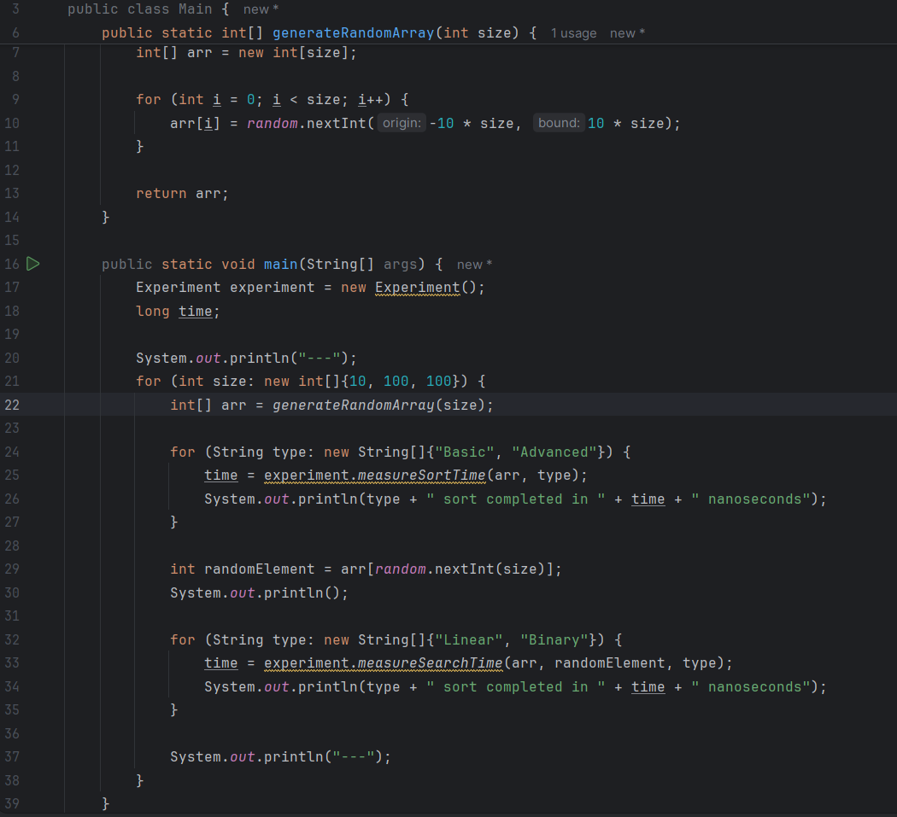
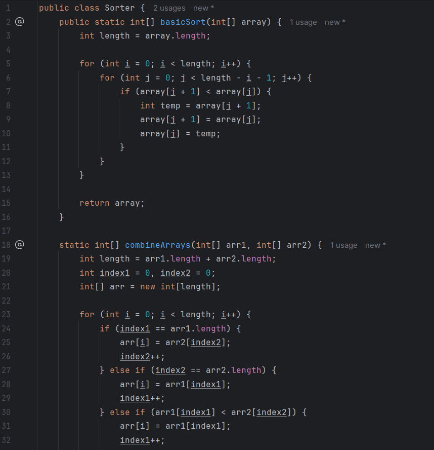
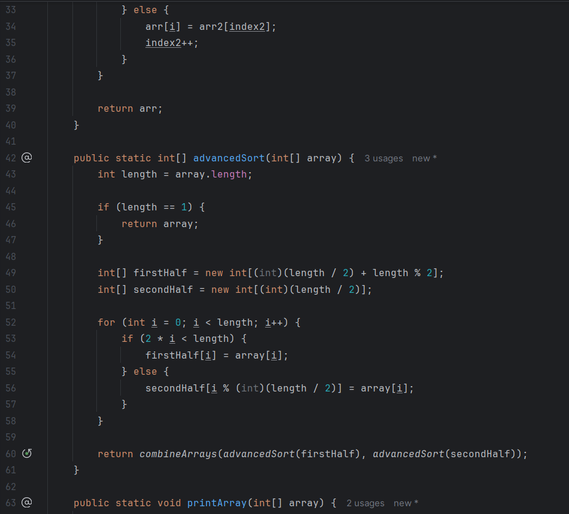
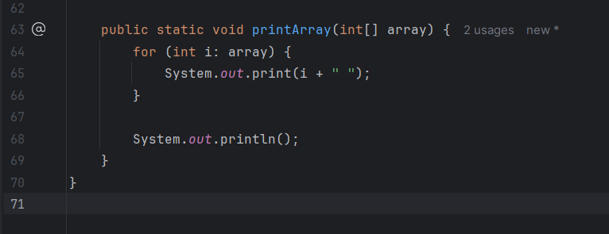
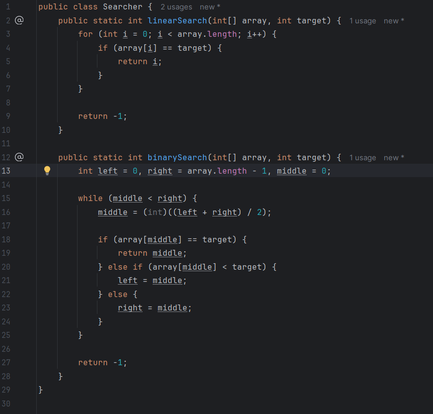
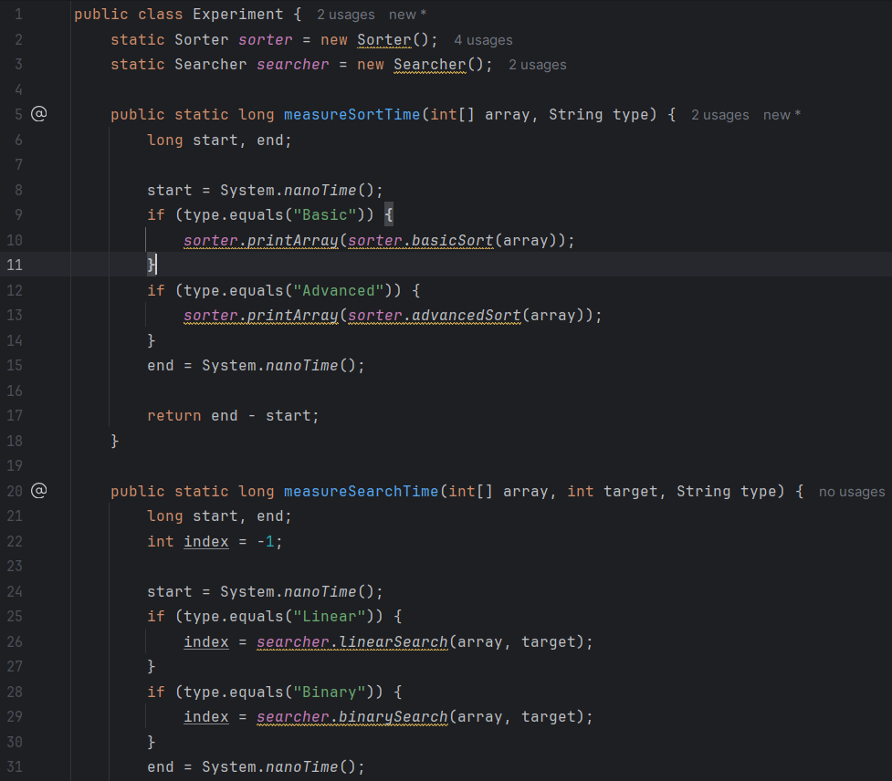
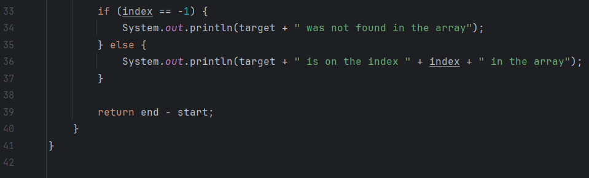

# Azat Dauletbek, IT-2504

## Assignment 3 - Sorting and searching algorithms

---

`Main` class with all of the experiments being held.

---

`Sorter` class, utilizing bubble sort for the basic sorting algorithm and merge sort for the advanced sorting algorithm. Also contains `printArray()` method.

---

`Searcher` class, utilizing both linear and binary searching algorithms.

---

`Experiment` class, with all of the required tools for comparing the algorithms implemented.

---

| Algorithm/Size                | 10 (random) | 100 (random) | 1000 (random) | 10 (sorted) | 100 (sorted) | 1000 (sorted) |
|-------------------------------|-------------|--------------|---------------|-------------|--------------|---------------|
| Basic sorting (Bubble)        | 21619000 ns | 1143800 ns   | 1166800 ns    | 139400 ns   | 1346800 ns   | 1425500 ns    |
| Advanced sorting (Merge)      | 142500 ns   | 866700 ns    | 994600 ns     | 187800 ns   | 1401900 ns   | 1100800 ns    |
| Linear search                 | 4200 ns     | 1100 ns      | 1900 ns       | 1000 ns     | 2100 ns      | 3000 ns       |
| Binary search (always sorted) |             |              |               | 1300 ns     | 1400 ns      | 1500 ns       |

---

## Analysis questions

- _Which sorting algorithm performed faster? Why?_ An advanced sorting algorithm performed faster, even though it seems like by only a bit.
- _How does performance change with input size?_ As the data size increases, the advanced sorting performs much better than basic sorting, due to having `O(n logn)` time complexity, which is significantly faster than `O(n^2)`.
- _How does sorted vs unsorted data affect performance?_ The algorithms, that I have chosen, do not change based on whether the input is already sorted or not.
- _Do the results match the expected Big-O complexity?_ The change may not seem significant but it's because of, relatively, small imput size. 1000 elements is not that much. The real difference and the match with Big-O time complexity is seen with much larger input sizes.
- _Which searching algorithm is more efficient? Why?_ If the inputted array is sorted, then definitely binary search. Otherwise, linear search is the best option.
- _Why does Binary Search require a sorted array?_ Because as it checks the middle index between two pointers, it assumes that all values to the right of the middle are greater and all values to the left of the middle are lesser.